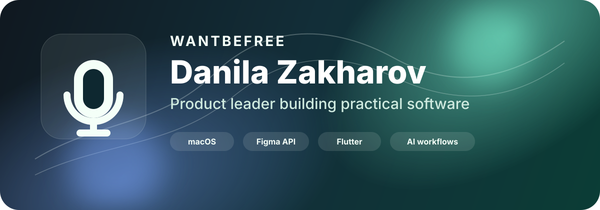

  

  <h1>Danila Zakharov</h1>

  

    <strong>Head of Product</strong> building practical software where design, AI, and engineering meet.
    I turn recurring workflow pain into focused tools, from macOS utilities to Figma plugins and mobile apps.
  

  

    
    
    
  

---

## What I do

- Product strategy, discovery, UX, and execution for consumer and productivity software.
- AI-assisted workflows, internal automation, ASO tooling, and product operations.
- Native macOS utilities, Flutter mobile apps, and Figma plugin experiments.
- Opinionated tools for real user problems, not abstract demos.

## Featured work

| Project | What it solves | Stack |
| --- | --- | --- |
| [MicLock](https://github.com/WantbeFree/MicLock) | Keeps macOS on the right microphone so AirPods, Sony WH-1000XM, and other Bluetooth headsets do not degrade audio quality by switching into headset mic mode. | Objective-C, CoreAudio, macOS |
| [Homebrew Tap](https://github.com/WantbeFree/homebrew-tap) | Distributes MicLock through a clean Homebrew cask flow. | Ruby, Homebrew |
| Figma plugin work | Product/design automation around translation, content, and design workflows. | JavaScript, Figma API |
| Mobile product work | Mobile apps with product, UX, monetization, and ASO focus. | Flutter, Dart |

## Product approach

I like products that are small on the surface and sharp underneath:

- clear user pain;
- fast path to value;
- strong defaults;
- minimal setup;
- practical automation;
- measurable distribution loops.

## Stack and tools

  
  
  
  
  
  
  
  
  
  

## Current interests

- AI-native product workflows that remove repetitive product and marketing work.
- macOS utilities for creators, streamers, podcasters, and remote teams.
- Figma plugin automation for designers and product teams.
- Mobile growth: ASO, onboarding, paywalls, retention, and localization.

## GitHub snapshot

  
  

## Search keywords

Product leader, Head of Product, macOS utility, CoreAudio, Bluetooth microphone fix, AirPods microphone quality, Sony WH-1000XM headset mode, Figma plugin, Flutter app, AI product workflows, ASO automation, mobile growth, UX strategy.

## Contact

- LinkedIn: [linkedin.com/in/wantbefree](https://www.linkedin.com/in/wantbefree/)
- GitHub: [github.com/WantbeFree](https://github.com/WantbeFree)

